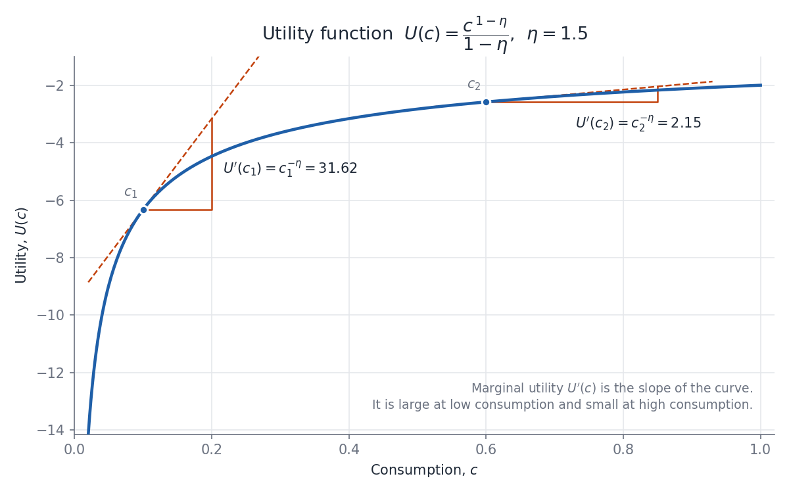

# scratchpad

A home for small, self-contained pieces of work — mostly illustrative figures — that are too small to deserve their own repository but worth keeping, versioning, and coming back to from any computer.

## How this repository is organized

- Each topic lives in its own folder at the top level.
- Each folder contains the script that produces its output, plus the rendered output itself (e.g. PNG and PDF), so results can be viewed on GitHub without running anything.
- Python dependencies are shared in the top-level `requirements.txt`.

## Setup

```bash
git clone https://github.com/KCaldeira/scratchpad.git
cd scratchpad
python3 -m venv .venv
.venv/bin/pip install -r requirements.txt
```

## Topics

### 1. Utility function and marginal utility — [`utility-function/`](utility-function/)



Plots the constant relative risk aversion (CRRA) utility function

$$U(c) = \frac{c^{1-\eta}}{1-\eta}$$

with η = 1.5, for illustrative purposes. Tangent lines and slope triangles at two consumption levels (c₁ = 0.1, c₂ = 0.6) show the marginal utility U′(c) = c^(−η): large at low consumption (31.62) and small at high consumption (2.15).

Because η > 1, utility values are negative (U(c) = −2/√c); only the shape and slopes matter for the illustration.

Regenerate the figure:

```bash
.venv/bin/python utility-function/utility_fig.py
```

## Adding a new topic

1. Create a new top-level folder with a short, descriptive name.
2. Put the script and its rendered outputs in it.
3. Add any new dependencies to `requirements.txt`.
4. Add a numbered entry under **Topics** above.
